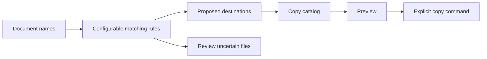

# Document Routing

Turn a folder of documents into a reviewable filing plan, then copy approved files without replacing existing work.

The Python tool examines filenames and folder names using rules you supply. It flags uncertain matches for review. The PowerShell tool previews a copy catalog and requires an explicit command to copy files. The included demonstration uses an entirely fictional library exhibit.

[Try the example](#try-the-example) · [How it works](#how-it-works) · [Python reference](python/README.md) · [PowerShell reference](powershell/README.md) · [Testing](docs/TESTING.md) · [About this edition](docs/PUBLIC-EDITION.md)

## Try the example

With Python 3.10 or newer installed, run:

```sh
cd python
python3 -B demo.py
```

The demonstration creates its own temporary documents, prints a filing plan and removes its temporary directory afterward. It does not need access to your documents. See the [example rules](python/examples/rules.json) and [expected plan](python/examples/expected-plan.csv).

The included five-document example produces **3 proposed destinations and 2 review items**:

| Fictional document | Result |
| --- | --- |
| `ExhibitLabel.txt` | `Exhibits/Labels/ExhibitLabel.txt` |
| `LightingNotes.txt` | `Exhibits/Lighting/LightingNotes.txt` |
| `label-lighting.txt` | Review: two different destinations match |
| `mystery.txt` | Review: no matching rule |
| `Atrium.txt` in `sketches/` | `Exhibits/Sketches/Atrium.txt` |

Only the three unambiguous rows enter the copy catalog. Review rows cannot silently become copy instructions.

## How it works



A document with one clear destination can enter the copy catalog. Missing signals and conflicting matches stay in the review output. The classifier examines names, not document contents.

Copying is a separate step. The default preview makes no filesystem changes. An explicitly requested report may create a new log file. During an explicitly requested copy, the copier skips identical destination files and reports conflicts instead of overwriting them. It does not delete source files.

## Use your own rules

The [Python reference](python/README.md) documents catalog creation, rule configuration and copy-catalog export. The [PowerShell reference](powershell/README.md) documents preview, execution and per-file results. Start with the fictional example and review its plan before using a new configuration.

## Engineering and validation

The tools separate classification decisions from filesystem changes. They check relative paths, preserve review outcomes and produce inspectable results. The copier uses content hashes to distinguish identical files from conflicts.

[Testing](docs/TESTING.md) records what was run and the remaining platform limits. [About this edition](docs/PUBLIC-EDITION.md) explains the recovered-code provenance, excluded material, contribution guidance and unassigned license.
