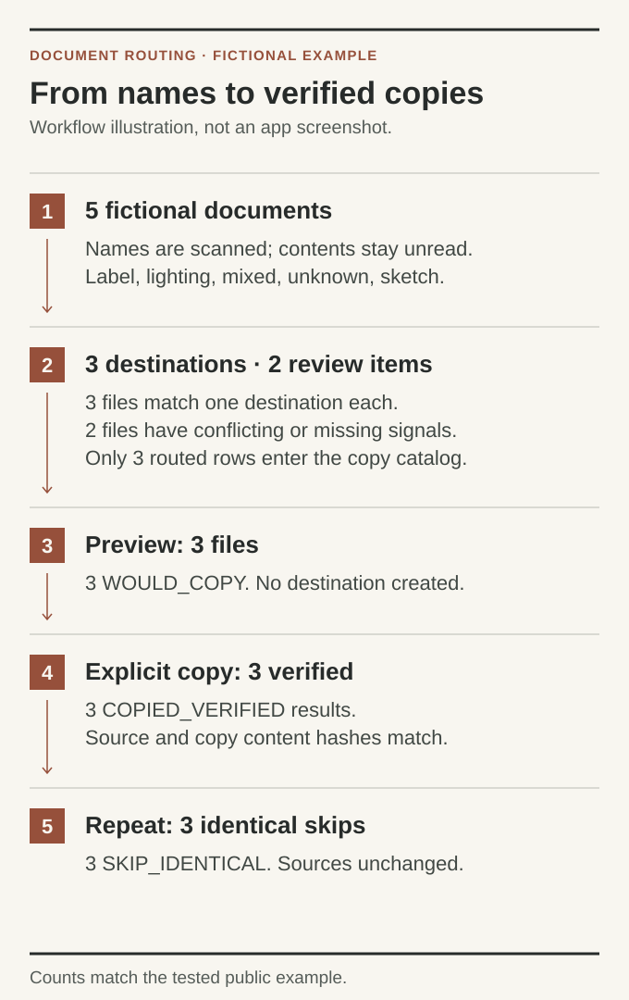

# Document Routing

Turn a folder of documents into a reviewable filing plan, then copy approved files without replacing existing work.

I created the original automation during my internship at **Curo**, using AI-assisted development to work on document organization and migration. This repository presents the reusable engineering from that work in a public edition with independently invented examples.

The Python tool examines filenames and folder names using rules you supply. It flags uncertain matches for review. The PowerShell tool previews a copy catalog and requires an explicit command to copy files. The included demonstration uses an entirely fictional library exhibit.

[Project background](#project-background-and-my-contribution) · [Try the example](#try-the-example) · [How it works](#how-it-works) · [Python reference](python/README.md) · [PowerShell reference](powershell/README.md) · [Testing](docs/TESTING.md) · [About this edition](docs/PUBLIC-EDITION.md)

## Try the example

With Python 3.10 or newer installed, run:

```sh
cd python
python3 -B demo.py
```

The demonstration creates its own temporary documents, prints a filing plan and removes its temporary directory afterward. It does not need access to your documents. See the [example rules](python/examples/rules.json) and [expected plan](python/examples/expected-plan.csv).

The included five-document example produces **3 proposed destinations and 2 review items**:

| Fictional document | Result |
| --- | --- |
| `ExhibitLabel.txt` | `Exhibits/Labels/ExhibitLabel.txt` |
| `LightingNotes.txt` | `Exhibits/Lighting/LightingNotes.txt` |
| `label-lighting.txt` | Review: two different destinations match |
| `mystery.txt` | Review: no matching rule |
| `Atrium.txt` in `sketches/` | `Exhibits/Sketches/Atrium.txt` |

Only the three unambiguous rows enter the copy catalog. Review rows cannot silently become copy instructions.

## How it works



This is a workflow illustration, not an app screenshot. It follows the [tested example](tests/verify_pipeline.py): **5 inputs → 3 routed + 2 review → 3 preview results → 3 verified copies → 3 identical-file skips**. The separate Python demo stops at the plan; the complete test also runs the PowerShell copy steps. All counts describe newly invented example files.

To reproduce the complete walkthrough with Python and PowerShell installed, run from the repository root:

```sh
python3 -B tests/verify_pipeline.py
```

The test creates temporary files, runs preview and explicit copy, repeats the copy, and confirms a deliberately changed destination is preserved as a conflict. [Setup and platform limits](docs/TESTING.md) explain what is required.

A document with one clear destination can enter the copy catalog. Missing signals and conflicting matches stay in the review output. The classifier examines names, not document contents.

Copying is a separate step. The default preview makes no filesystem changes. An explicitly requested report may create a new log file. During an explicitly requested copy, the copier skips identical destination files and reports conflicts instead of overwriting them. It does not delete source files.

## Project background and my contribution

The engineering problem was making a document migration inspectable and repeatable. A useful script needs to explain its decisions, leave uncertain cases for review and handle a second run without silently replacing existing work.

I defined the requirements, directed AI-assisted implementation and worked through iterations and troubleshooting. Preparing this public edition also required separating reusable code from private operational details, replacing the original rules and data, and verifying the resulting workflow.

### What this demonstrates

| Skill | Evidence in this repository |
| --- | --- |
| Turning an operational problem into configurable automation | [Rule-driven classification](python/router.py) separates matching rules from file copying |
| Handling ambiguous and conflicting inputs | [Planner tests](python/tests/test_router.py) cover competing destinations, duplicate paths and no-signal files |
| Designing a reviewable workflow | [The example plan](python/examples/expected-plan.csv) exposes each decision before the copy stage |
| Building reliable filesystem operations | [The copier](powershell/Copy-WorkshopFiles.ps1) checks paths, previews changes, compares hashes and preserves conflicts |
| Testing failures and repeat runs | [The complete workflow test](tests/verify_pipeline.py) verifies copying, rerun skips, conflict preservation and unchanged sources |
| Making technical work usable by others | [Setup and validation instructions](docs/TESTING.md) let readers reproduce the demonstration with fictional data |

The public edition adapts the earlier tool; it does not reproduce Curo's internal workflow. The configurable rules, demonstration data and tests were written for this edition. Its strengthened copy safeguards are verified here, not claimed as features deployed during the internship. No client records, internal routing rules or operational logs are included.

## Use your own rules

The [Python reference](python/README.md) documents catalog creation, rule configuration and copy-catalog export. The [PowerShell reference](powershell/README.md) documents preview, execution and per-file results. Start with the fictional example and review its plan before using a new configuration.

## Engineering and validation

The tools separate classification decisions from filesystem changes. They check relative paths, preserve review outcomes and produce inspectable results. The copier uses content hashes to distinguish identical files from conflicts.

[Testing](docs/TESTING.md) records what was run and the remaining platform limits. [About this edition](docs/PUBLIC-EDITION.md) explains the recovered-code provenance, excluded material, contribution guidance and unassigned license.
